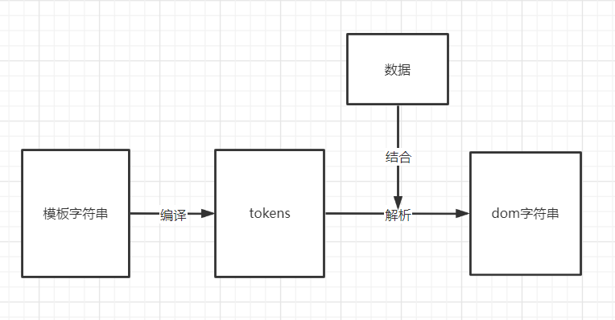

##  模板引擎是将数据变为视图最优雅的解决方案  (高端就完事了)

- Dom
- join（+ es6模板字符）
  - innerHTML 的标签解析
- 模板引擎

## 正则实现简版

```js
var tempStr = `<h2>{{n1}}，{{n2}}被妖怪抓走了。</h2>`
var data = {
    n1:'大师兄',
    n2:'八戒'
}
var render = function(tempStr,data){
    return tempStr.replace(/\{\{(\w+)\}\}/g,function(findStr,$1){
        return data[$1]
    })
}

var result = render(tempStr,data)
```

## tokens

```js
//是一个js的嵌套数组，模板字符串的js表示
//是“抽象语法树AST”，“虚拟节点”的引导者
```

```js
//模板字符串：<h2>{{n1}}，{{n2}}被妖怪抓走了。</h2>
tokens = [
    ["text","<h2>"],//token
    ["name","n1"],
    ["text","，"],
    ["name","n2"],
    ["text","被妖怪抓走了。"],
]
```

```js
var temp = `<div><ul>{{#arr}}<li>{{.}}</li>{{/arr}}</ul></div>`
tokens = [
    ["text","<div><ul>"],
    ["#","arr",[
        ["text","<li>"],
        ["name","."],
        ["text","</li>"],
    ]],
    ["text","</ul></div>"]
]
```




